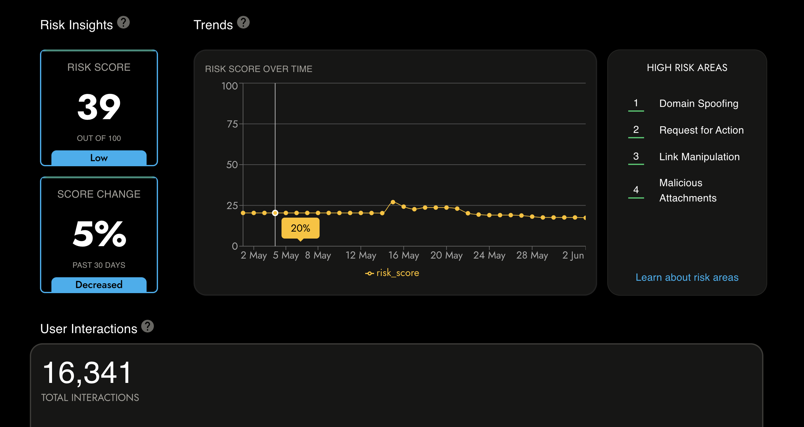
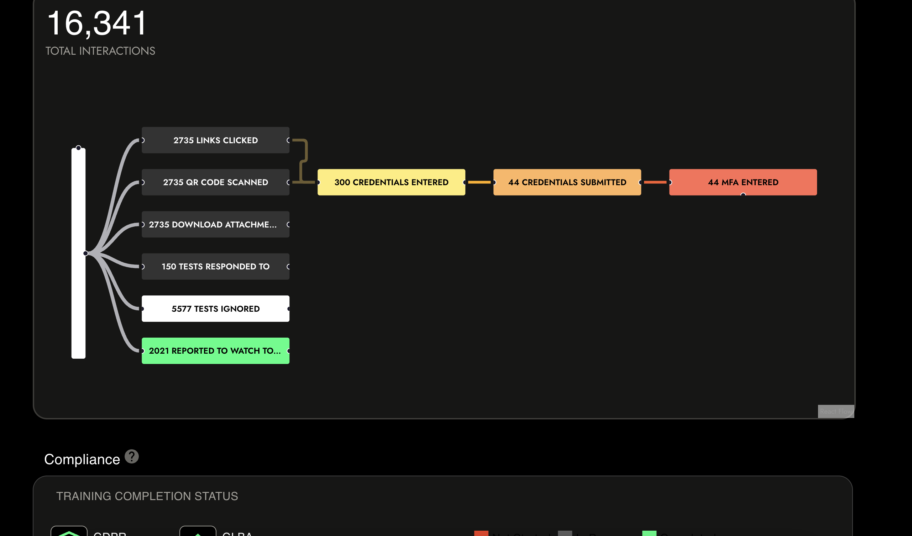
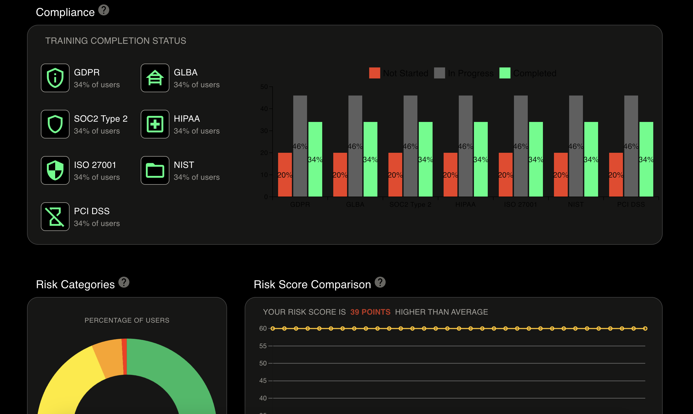
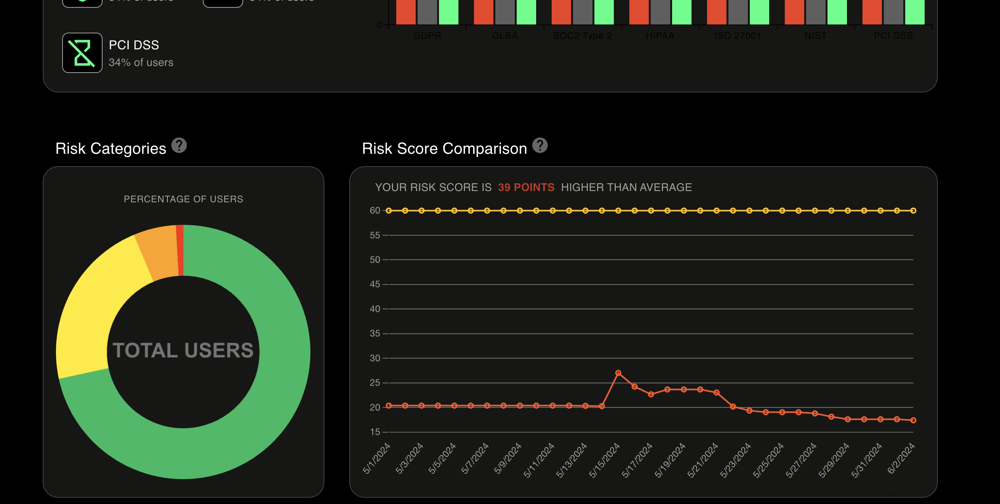

# Security Dashboard

### Live Demo - https://dune-security-dashboard.vercel.app/

## 💡 Project Description

Security Dashboard

## 📺 Preview









## 📌 Prerequisites

### 💻 System requirement :

1. Any system with basic configuration.
2. Operating System : Any (Windows / Linux / Mac).

### 💿 Software requirement :

1. Updated browser
2. Node.js installed (If not download it [here](https://nodejs.org/en/download/)).
3. Any text editor of your choice.

## Technologies used 🖥️

- [x] ReactJS
- [x] TypeScript
- [x] Material UI
- [x] Recharts
- [x] Reactflow
- [x] Jest
- [x] Husky
- [x] Prettier
- [x] ESLint

## Installation 🔧

Install dependencies

```
$ yarn install
```

or

```
$ npm install
```

Start the website development server

```
$ yarn start
```

or

```
$ npm run start
```
